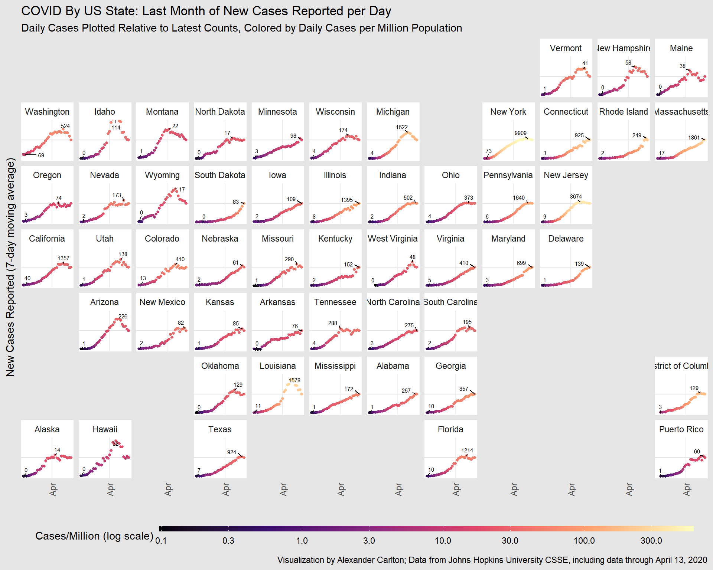
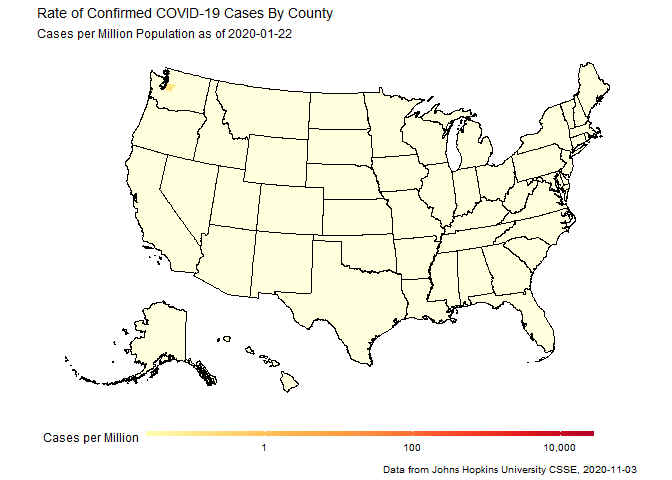
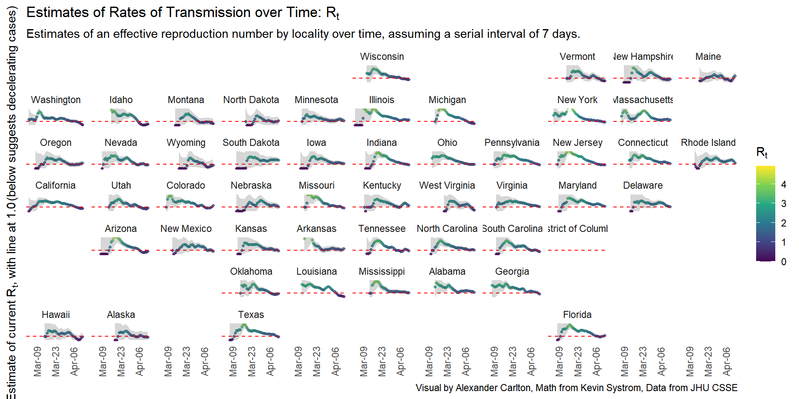

# neat-and-tidy
Exploring some neat tools in the tidyverse library for R,
https://www.tidyverse.org.
Based on the COVID-19 data
provided by the CSSE team at Johns Hopkins University,
https://github.com/CSSEGISandData/COVID-19.
  
These examples are discussed in a
[blog post](https://www.fisodd.com/code/neat-and-tidy).

## Small Multiples

Using "dplyr" and "ggplot" to generate useful charts
from the COVID-19 case counts.

## Animated Choropleth

Adding "geom_sf" to "gganimate" to create animated maps
of the spread of COVID-19 cases across the US.

## Realtime Rt

A quick sample of using "purrr" tools to do a series of number-crunching
calculations in a neat and tidy way.

